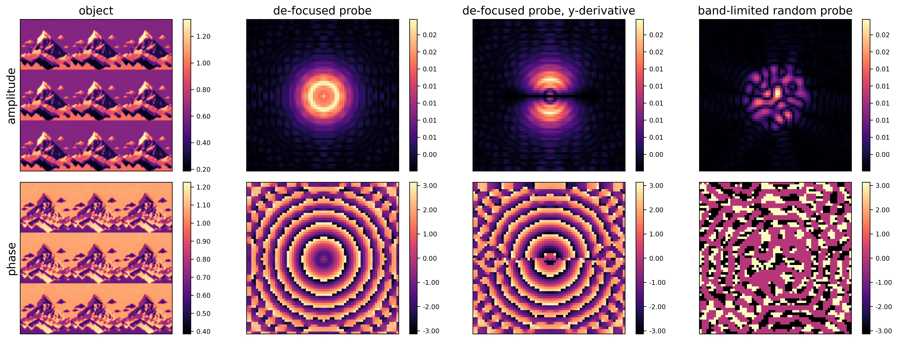

# Signal and Noise in Ptychographic Imaging



## Overview

This project investigates signal-to-noise trade-offs in ptychographic phase retrieval under realistic Poisson noise. The work formulates ptychography as a nonlinear inverse problem and compares two loss functions for optimization: Poisson negative log-likelihood (PNLL, statistically principled) versus mean-squared error on amplitudes (MSE, computationally efficient). Using fully controlled synthetic datasets with the difference map algorithm, this study systematically characterizes how experimental parameters (photon fluence, scan step size, probe partial coherence) interact with algorithm choices to affect reconstruction quality. Results provide actionable guidelines for X-ray imaging protocol optimization.

## Research Questions

- **Loss function trade-offs**: Does the statistically optimal Poisson NLL justify its computational cost vs. simpler MSE amplitude loss?
- **Probe mode efficiency**: How do random band-limited decompositions compare to analytical partial coherence (directional derivatives) in terms of reconstruction quality vs. computational overhead?
- **Fluence-convergence interaction**: At what photon flux regime does iterative reconstruction become infeasible, and how does this depend on probe design?
- **Step size optimization**: What is the optimal balance between scan step size, data efficiency, and algorithm convergence for different fluence regimes?

## Methodology

**Mathematical Formulation**:
- Exit-wave model with Fourier-space intensity constraints
- Dual loss functions: Poisson NLL (statistically principled) and MSE amplitude (efficient approximation)
- Reconstruction under Poisson noise modeled as photon counting statistics

**Optimization Algorithm**:
- Difference map algorithm with configurable step sizes and iteration counts
- Two-stage strategy: coarse-to-fine convergence for improved stability
- Error metrics: MSE on complex exit wave and SSIM for perceptual quality

**Experimental Design** (Fully Synthetic):
1. **De-focused ring probe**: Single illumination mode, 1-pixel steps
2. **Band-limited random probes**: 1–22 pixels, 1–10 random Fourier modes
3. **Partial coherence (y-derivative)**: Ring + first-order derivative modes with varying weights
4. **Fluence sweep**: 1 to 10^7 photons/pixel to isolate noise regimes
5. **Step size variation**: 0.1 to 10 pixels to map convergence landscape

**Computational Stack**: NumPy/SciPy numerical optimization, HPC Slurm execution for parameter space exploration
## Key Findings

**Quantitative Results**:
- **No-reconstruction threshold**: f < 1 photon/pixel → iterative reconstruction fails; below this, noise dominates
- **Optimal step size**: 7–10 pixels balances convergence speed and noise robustness across tested fluences
- **Loss function comparison**: PNLL achieves ~10–20% better phase reconstruction fidelity than MSE amplitude but requires 2–3× longer computation
- **Probe efficiency**: 3–5 band-limited random modes suffice to match analytical partial coherence performance
- **Mode sensitivity**: Adding modes beyond 10 increases reconstruction error by approximately 1 order of magnitude due to noise amplification

**Trade-Offs Identified**:
1. **Fluence vs. experiment time**: Lower photon flux requires longer integration, increasing thermal drift risk
2. **Step size vs. data**: Larger steps reduce scan time but degrade phase reconstruction (requires higher fluence)
3. **Loss function choice**: PNLL statistically optimal but MSE amplitude acceptable for quick parameter screening
4. **Partial coherence**: Adding modes improves low-fluence behavior but increases sensitivity to experimental misalignment

**Implications for Practice**: Results guide beamline optimization—minimal photon flux is 10–100 photons/pixel; scan step size selection depends on coherence assumption and available integration time

## Project Structure

```
├── analysis.ipynb                  # Main analysis and plotting notebook
├── requirements.txt                # Python dependencies
├── run_experiment.py               # Entry point for running simulations
├── figures/                        # Generated plots and visualizations
├── logs/                           # Simulation logs
├── outputs/                        # Simulation results (.pkl files)
│   ├── bandlim/                   # Band-limited random probe experiments
│   ├── grad_1direction/           # Directional derivative probe experiments
│   ├── steps_bandlim5/            # Step size variation experiments
│   └── rec_fluence.pkl            # Fluence sweep results
├── src/                            # Core simulation and utility modules
│   ├── constants.py               # Global configuration and parameters
│   ├── metrics.py                 # Error and quality metrics
│   ├── ptychography.py            # Ptychographic reconstruction functions
│   ├── reconstruction.py          # High-level reconstruction workflow
│   ├── utils.py                   # Utility functions
│   └── visualisation.py           # Plotting and visualization tools
└── experiments/                    # Simulation scripts
    ├── sim_bandlim.sh             # Band-limited probe variations
    ├── sim_fluence.sh             # Fluence sweep experiment
    ├── sim_grad_1direction.sh     # Directional derivative experiment
    └── sim_steps_bandlim.sh       # Step size variation experiment
```

## Quick Start

### Installation

1. Clone the repository:
   ```bash
   git clone https://github.com/raphassaraf/Signal-and-noise-in-ptychographic-imaging.git
   cd Signal-and-noise-in-ptychographic-imaging
   ```

2. Install dependencies:
   ```bash
   pip install -r requirements.txt
   ```

### Running Experiments

Experiments are designed to run on HPC systems with Slurm:
```bash
sbatch experiments/sim_bandlim.sh
sbatch experiments/sim_fluence.sh
sbatch experiments/sim_grad_1direction.sh
sbatch experiments/sim_steps_bandlim.sh
```

Results are saved to `outputs/` directory organized by experiment type.

### Analyzing Results

Once simulations complete, generate plots and analysis:
```bash
jupyter notebook analysis.ipynb
```

## Project Context

This project was conducted as a semester research project at the **Computational X-ray Imaging Group**, Swiss Federal Institute of Technology Lausanne (EPFL), in collaboration with the **Paul Scherrer Institute (PSI)**. The work forms part of ongoing research into optimization of coherent X-ray imaging techniques for materials science and structural biology applications.

**Author**: Raphael Assaraf (raphael.assaraf@epfl.ch)

## Possible Extensions

**Machine Learning**:
- Neural network-based phase retrieval (unrolled optimization networks, end-to-end learned algorithms)
- Learned regularization for noise robustness
- Generative models for reconstructing undersampled measurements

**Computational Optimization**:
- GPU acceleration (CuPy/JAX) for large-scale 3D ptychography
- Parallelized parameter searches over hyperparameter space
- Differentiable programming to backprop through reconstruction pipeline

**Algorithmic Improvements**:
- Adaptive step size scheduling based on convergence metrics
- Multi-scale/coarse-to-fine approaches for accelerated convergence
- Comparison with proximal algorithms and stochastic optimization variants

**Robustness & Real Data**:
- Validation against experimental beamline data (PSI)
- Noise model refinement (detector effects, beam coherence fluctuations)
- Uncertainty quantification for reconstruction confidence maps

## Acknowledgements

Parts of this project were inspired by and utilize the [CDTools](https://cdtools-developers.github.io/cdtools-docs/examples.html) library developed by Abraham Levitan.
