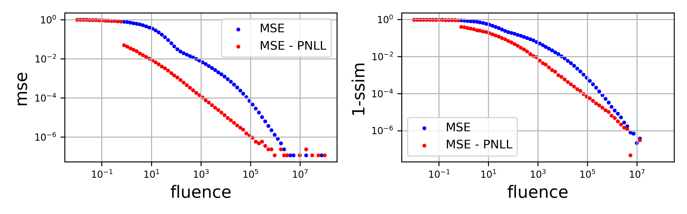
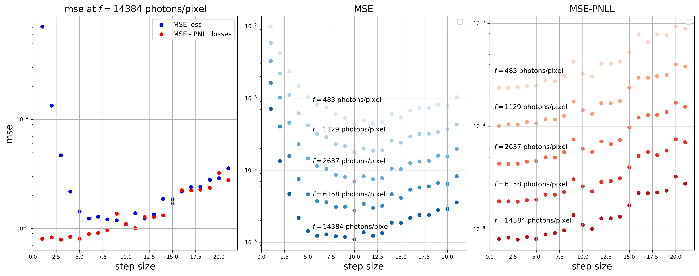
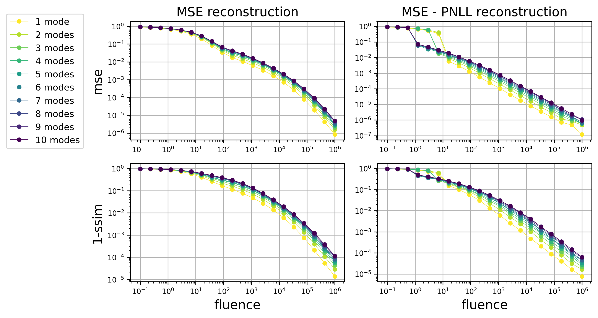

# Signal and Noise in Ptychographic Imaging


## Overview

This project investigates trade-offs in ptychographic phase retrieval under various experimental parameters and Poisson noise. Ptychography is a computational microscopy technique reconstructing an object from diffraction patterns obtained through overlapping illuminations at multiple overlapping scanning positions. This work formulates it as a nonlinear inverse problem and compares two loss functions for optimization: Poisson negative log-likelihood (PNLL, statistically principled) versus mean-squared error on amplitudes (MSE, computationally efficient). Using fully controlled synthetic datasets, this study systematically characterizes how experimental parameters (photon fluence, scan step size, probe partial coherence) interact with algorithm choices to affect reconstruction quality. Results provide actionable guidelines for X-ray imaging protocol optimization.

## Research Questions

- **Loss function trade-offs**: Does the statistically optimal Poisson NLL justify its computational cost vs. simpler MSE amplitude loss?
- **Fluence-convergence interaction**: At what photon flux regime does iterative reconstruction become infeasible, and how does this depend on probe design?
- **Step size optimization**: What is the optimal balance between scan step size, data efficiency, and algorithm convergence for different fluence regimes?
- **Probe mode efficiency**: How does increasing probe decoherence (multi-mode mixtures) affect reconstruction error scaling, and are different loss functions equally sensitive to partial coherence?

## Method Overview

The project employs numerical simulations of the ptychographic forward model and reconstructs the object via gradient-based maximum likelihood optimization using L-BFGS. Reconstructions are performed under Poisson noise assumptions using both MSE-amplitude and Poisson negative log-likelihood (PNLL) losses.

Multiple experimental scenarios are tested:

- **Band-limited random probes:** Systematic variation of the number of incoherent modes to quantify decoherence effects.
- **Directional derivative modes:** Analysis of structured partial coherence by combining ring illumination with its gradient mode.
- **Fluence sweeps:** Characterization of reconstruction error scaling across photon flux regimes.
- **Step size analysis:** Evaluation of sampling redundancy and sub-Nyquist effects on reconstruction quality.

## Key Results

The simulations reveal clear regime transitions in reconstruction quality as a function of photon fluence, scan step size, and probe coherence. In particular:

- The Poisson negative log-likelihood (PNLL) loss consistently outperforms the MSE-amplitude approximation in low-fluence regimes.
- PNLL-based reconstruction error exhibits power-law decay regions across fluence sweeps.


- Sub-Nyquist scanning introduces a non-trivial trade-off between redundancy and photon statistics.


- Increasing probe decoherence (multi-mode mixtures) systematically degrades reconstruction accuracy.



Results are quantified using mean square error (MSE) and structural similarity (SSIM) metrics, alongside amplitude and phase reconstructions.

## Project Structure

```
├── analysis.ipynb                  # Main analysis and plotting notebook
├── requirements.txt                # Python dependencies
├── run_experiment.py               # Entry point for running simulations
├── figures/                        # Generated plots and visualizations
├── logs/                           # Simulation logs
├── outputs/                        # Simulation results (.pkl files)
│   ├── bandlim/                   # Band-limited random probe experiments
│   ├── grad_1direction/           # Directional derivative probe experiments
│   ├── steps_bandlim5/            # Step size variation experiments
│   └── rec_fluence.pkl            # Fluence sweep results
├── src/                            # Core simulation and utility modules
│   ├── constants.py               # Global configuration and parameters
│   ├── metrics.py                 # Error and quality metrics
│   ├── ptychography.py            # Ptychographic reconstruction functions
│   ├── reconstruction.py          # High-level reconstruction workflow
│   ├── utils.py                   # Utility functions
│   └── visualisation.py           # Plotting and visualization tools
└── experiments/                    # Simulation scripts
    ├── sim_bandlim.sh             # Band-limited probe variations
    ├── sim_fluence.sh             # Fluence sweep experiment
    ├── sim_grad_1direction.sh     # Directional derivative experiment
    └── sim_steps_bandlim.sh       # Step size variation experiment
```

## Quick Start

### Installation

1. Clone the repository:
   ```bash
   git clone https://github.com/raphassaraf/Signal-and-noise-in-ptychographic-imaging.git
   cd Signal-and-noise-in-ptychographic-imaging
   ```

2. Install dependencies:
   ```bash
   pip install -r requirements.txt
   ```

### Running Experiments


You can run experiments directly using the portable Python script. Each simulation sets an experimental parameter (`n-modes`, `principal-mode-weight`, `steps-size`) sweeps over `n-fluences` photon fluences:

```bash
# Fluence sweep
python run_experiment.py fluence --n-fluences 10

# Band-limited modes sweep
python run_experiment.py bandlim --n-modes 5 --n-fluences 10

# Gradient mode (1 direction, principal-mode-weight --> integer between 0 and 9)
python run_experiment.py grad-1direction --principal-mode-weight 5 --n-fluences 10

# Scanning step size sweep
python run_experiment.py steps-bandlim --steps-size 8 --n-fluences 10

# Run all experiments with default parameters
python run_experiment.py all
```

Results are saved to the `outputs/` directory, organized by experiment type.

### Analyzing Results

Once simulations complete, generate plots and analysis:
```bash
jupyter notebook analysis.ipynb
```

## Project Context

This project was conducted as a Master's semester research project with the **Computational X-ray Imaging Group** at the Swiss Federal Institute of Technology Lausanne (EPFL), in collaboration with the **Paul Scherrer Institute (PSI)**. The work forms part of ongoing research into optimization of coherent X-ray imaging techniques for materials science and structural biology applications.

**Author**: Raphael Assaraf (raphael.assaraf@epfl.ch)

## Acknowledgements

Parts of this project were inspired by and utilize the [CDTools](https://cdtools-developers.github.io/cdtools-docs/examples.html) library developed by Abraham Levitan.
